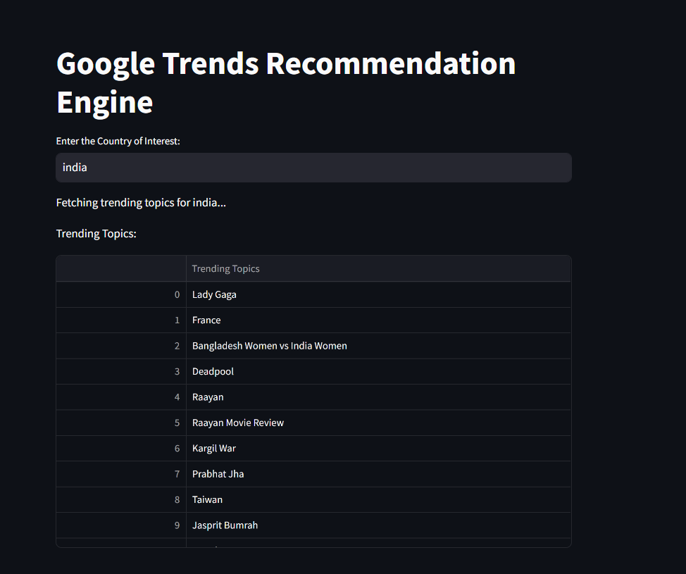

# Google Trends Recommendation Engine

## Overview

The Google Trends Recommendation Engine is a Streamlit application that fetches and displays trending topics for a specified country using the Google Trends API.

## Features

- Fetch trending topics for any specified country.
- Display the trending topics in a tabular format.

## Installation

1. **Clone the repository:**

   ```bash
   git clone https://github.com/much-sandeep/recommendation_engine.git
   cd google-trends-recommendation-engine
   ```

2. **Install the requirements from requirements.txt**
   ```bash
   pip install -r requirements.txt
   ```
3. **Run the app**
   ```bash
   streamlit run app.py
   ```
4. **Interface**
   

## Work in Progress

**Note:** This project is still under development. Features and documentation are subject to change. Your feedback and contributions are welcome!
